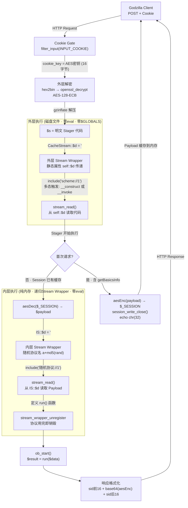
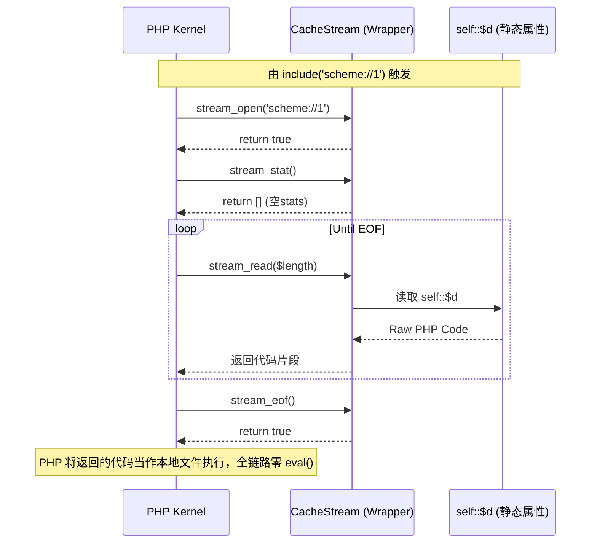

<h1 align="center">VeilShell</h1>

### Godzilla_AES加密器+采用打断与动态回调伪装的WebShell以及另一种自定义Stream Wrapper去除eval的webshell|Qwen2-0.5B-Instruc-webshell微调小模型检测方法与对抗。
插件是基于哥斯拉底层反射的自定义AES通信加密器

bypass_webshell.py基于AES+gzdeflate+Data-Flow Break(把它还放着主要是因为不依赖 stream wrapper，兼容低版本PHP，效果也还行)

**bypass_webshell_vei.py**基于AES+自定义Stream Wrapper注册+include执行，全链路零eval，类多态触发（部分严格环境如禁用stream_wrapper_register时无法使用）。

-----     

## 本项目生成的荷载在Qwen2-0.5B-Instruct模型中经过30k webshell数据集训练微调后的小模型分析，并未命中。同时在长亭、阿里等webshell检测中也绕过。

对于结果有疑虑可阅读：[Qwen2-0.5B-Instruc-webshell微调模型检测训练](./微调模型训练/README.md) 

注：该图展示的样本是二次过滤后的恶意样本，选了40+能过waf的phpwebshell进行测试。并不代表全量训练数据集，全量数据集采用了https://huggingface.co/datasets/nbuser32/PHP-Webshell-Dataset

> Test metrics: {'test_loss': 0.08689013123512268, 'test_accuracy': 0.973571192599934, 'test_f1': 0.9750623441396509, 'test_precision': 0.993015873015873, 'test_recall': 0.9577464788732394, 'test_runtime': 71.2095, 'test_samples_per_second': 42.508, 'test_steps_per_second': 2.668, 'epoch': 1.0}
---- 
---- 
### 长亭

### 阿里

### virustotal

正常连接及环境：

### post

